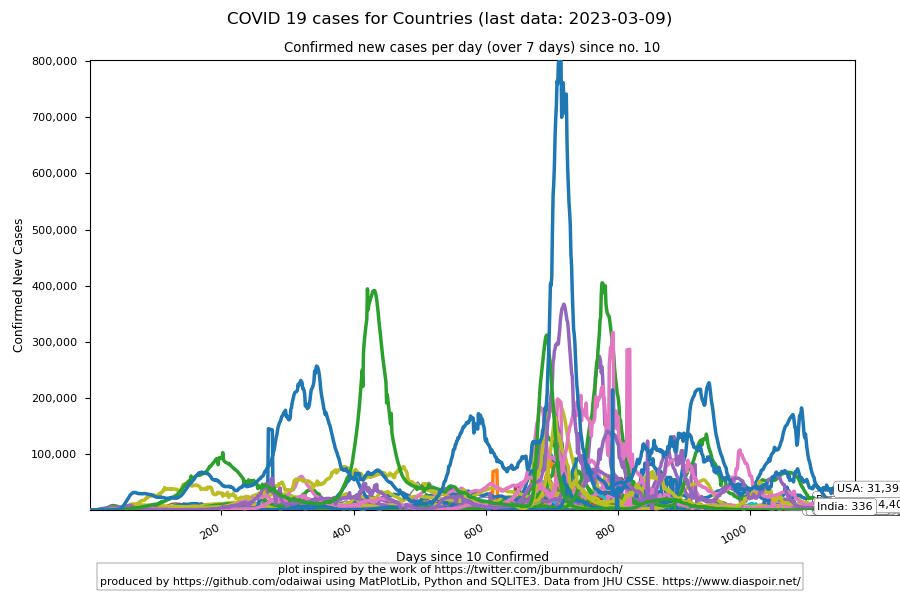

# COVID 19 Data tracker and plotter

This will produce images like below:

and 

# 2020 SARs-Cov / COVID 19
Some analysis on the COVID 19 /  Corona Virus outbreak of early 2020.

A bunch of scripts to get data files from a few sources, and also to process them.

This is a work in progress!

dave

## 3G.DXY.CN
This webpage seems to be aggregating content from Weibo.
 - get_3gdxy_data.py - Return the Body Text in text form
 - get_3gdxy_json.py - Return the JSON Data in CSV/JSON/HTML

## WHO Reports
The WHO is usually behind the times. Trailing indicator.
- get_disease_outbreak_news.pl - Retrieve the relevant WHO documents. Not parsed
  yet

## Hong Kong Government Information Office Press Releases
 - get_press_releases.pl - Get the HK Government Press Releases that might be
 - process_press_releases.pl - Attempt to estimate relevant data from the GIS
   PR feed

## Centre for Health Protection (HK) data
 - get_historic.pl - Get historic NID data 
 - process_nid_data.pl - Parse the Non-Communicable Infectionous Diseases data
 - I was going to compare to the SARS outbreak, but...

# 2020/03/11 - NOTES
 - This was started on the 5th of January, when initial reports of some sort of
   illness in Wuhan were started to appear in Hong Kong.  Hence the original name of the
   repository, and many references to Wuhan Coronvirus, etc.  
 - I've changed it now, as a certain US President is doubling down on using it
   to stoke up racial resentment propaganda.

## 2020/03/27 - NOTES

 - Added separate routines to download and process the data and to produce the
   graphs.

Yes, I know my Python isn't perfect - this is a work in progress, and I'm
learning every day.
